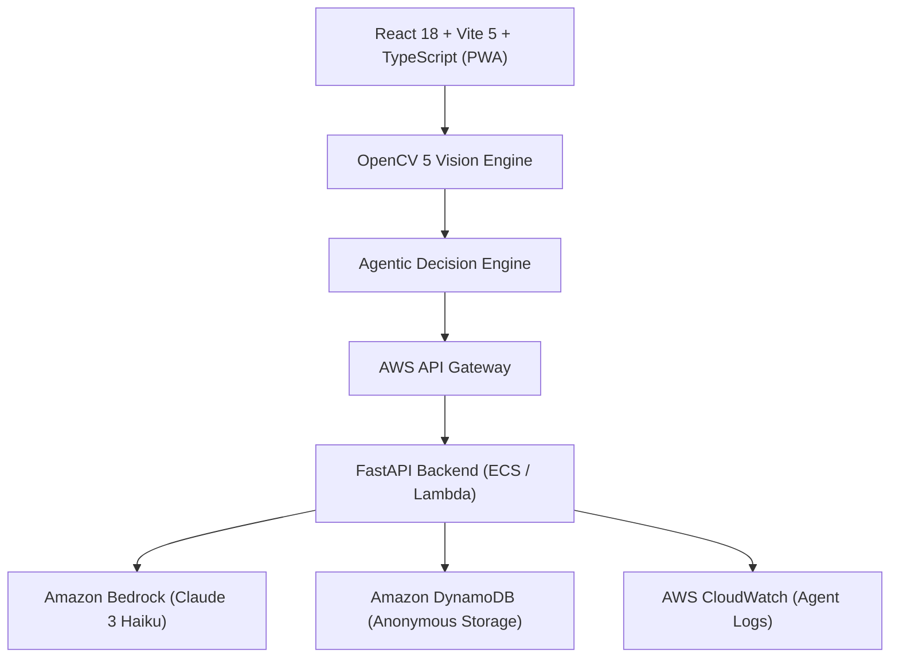

<p align="center">
  <h1 align="center">🩸 RaktaScan</h1>
  <h3 align="center">Agentic OpenCV 5 Vision for Non-Invasive Anemia Risk Pre-Screening</h3>
  <p align="center">
    <strong>OpenCV AI Competition 2026, powered by AWS</strong>
    <br />
    <em>Team Duo Tech (Vetha Narayanan G · Akshaya I)</em>
    <br />
    <br />
    <a href="#-opencv-ai-competition-2026-alignment">Competition Alignment</a> ·
    <a href="#-agentic-vision-active-perception-loop">Agentic Vision Loop</a> ·
    <a href="#-opencv-5-substantive-vision-engine">OpenCV 5 Engine</a> ·
    <a href="#-aws-cloud-architecture">AWS Architecture</a> ·
    <a href="#-quick-start">Quick Start</a>
  </p>
</p>

---

## 🏆 OpenCV AI Competition 2026 Alignment

RaktaScan is specifically engineered for the **OpenCV AI Competition 2026, powered by AWS** under the **Agentic Vision & Healthcare Triage** track.

```
                               PERCEIVE (OpenCV 5)
                                       │
                                       ▼
                                 UNDERSTAND
                                       │
                                       ▼
                                  AGENT DECIDE
                                       │
                ┌──────────────────────┴──────────────────────┐
                ▼                                             ▼
       ACTION / TOOL CALL                             VALIDATED EVIDENCE
(Recapture / Second View Request)                             │
                │                                             ▼
                ▼                                    FINAL RISK SCREENING
       RE-PERCEIVE (OpenCV 5)                                 │
                │                                             ▼
                └──────────────────────────────────► CONFIRMATORY GUIDANCE
```

### Key Judging Proof
> **VISUAL EVIDENCE CHANGES WHAT THE AGENT DOES NEXT**:
> When OpenCV 5 detects poor image quality (blur, dark, specular glare), the agent issues an operator correction (`REQUEST_RECAPTURE`). When OpenCV 5 measures borderline Erythrocyte Pallor ($0.35 \le \text{EPI} \le 0.65$), the agent actively requests a second visual capture (`REQUEST_SECOND_VIEW`) for cross-validation before outputting a screening result.

---

## ✨ System Capabilities

- **Substantive OpenCV 5 Vision Engine**: Laplacian variance sharpness, HSV/LAB luminance, specular glare masking, CIELAB $a^*$ redness index, Red/Green ratio, and Erythrocyte Pallor Index (EPI).
- **Multi-Frame Temporal Aggregation**: 5–15 frame sequence processing with trimmed-median outlier rejection.
- **Active Perception Decision Engine**: Real-time policy engine triggering `REQUEST_RECAPTURE`, `REQUEST_SECOND_VIEW`, `ACCEPT_LOW_RISK`, `ACCEPT_MODERATE_RISK`, `ACCEPT_HIGH_RISK`, or `REQUEST_HUMAN_REVIEW`.
- **MCP Tool Suite**: 10 Model Context Protocol tools (`analyze_capture_quality()`, `extract_conjunctiva_roi()`, `run_cross_validation()`, etc.).
- **Amazon Bedrock Integration**: AWS Bedrock agent orchestration, policy checking, and natural language explanation.
- **Agentic Vision Lab Dashboard**: Live interactive competition demonstration environment (`/lab`) displaying Agent Execution Trace logs and interactive MCP tool testing.
- **Live Eye Closed Detection**: Real-time video frame guidance warning users if their eye is closed or misaligned (**"⚠️ EYE CLOSED — Open eye wide"**).
- **Patient Screening Database**: Local-first record persistence with search, risk filters, detail view modals, and print/export functionality.

---

## 👁️ OpenCV 5 Substantive Vision Engine

OpenCV 5 performs image quality and tissue color analysis:

1. **Laplacian Variance Sharpness**:
   $$\text{Var}(\Delta I) = \frac{1}{N} \sum (L(x,y) - \mu_L)^2$$
2. **Specular Glare Masking**:
   Identifies highlight reflections in CIELAB space ($L > 230$) and measures glare surface percentage.
3. **CIELAB $a^*$ Redness Index**:
   Measures green-to-red tissue chromaticity ($a^*$) to detect conjunctiva capillary pallor.
4. **Erythrocyte Pallor Index (EPI)**:
   $$\text{EPI} = 0.50 \cdot a^*_{\text{norm}} + 0.35 \cdot (R/G)_{\text{norm}} + 0.15 \cdot S_{\text{norm}}$$

---

## ☁️ AWS Cloud Architecture



- **Amazon Bedrock**: Clinical AI orchestration & policy checks.
- **AWS API Gateway & FastAPI**: Containerized backend API.
- **Amazon DynamoDB & CloudWatch**: Anonymous session persistence and real-time agent trace logging.
- **Privacy-First**: Raw facial images are processed 100% on-device by default. Cloud sync requires explicit user opt-in.

---

## 🚀 Quick Start

### 1. Run Frontend Application
```powershell
cd frontend
npm install
npm run dev
```
Open **`http://localhost:5173/`** in your browser.

### 2. Run Agentic Vision Lab Dashboard
Navigate to **`http://localhost:5173/lab`** or click **🧪 Agentic Vision Lab** in the app header.

### 3. Run FastAPI Backend (Optional / AWS Mode)
```powershell
cd backend
python -m uvicorn backend.app.main:app --reload --port 8000
```

### 4. Run Automated Test Suite
```powershell
# Run TypeScript OpenCV 5 & Agent Engine tests
npx tsx tests/opencv_vision.test.ts
npx tsx tests/agent_engine.test.ts

# Run Python OpenCV & FastAPI tests
python -m unittest backend.tests.test_opencv_pipeline
```

---

## 👥 Team Duo Tech

| Name | Role |
|---|---|
| **Vetha Narayanan G** | Team Lead / Computer Vision & AI Engineer |
| **Akshaya I** | Healthcare UX & System Engineer |

---

## 📄 License

This project is licensed under the [MIT License](LICENSE).
