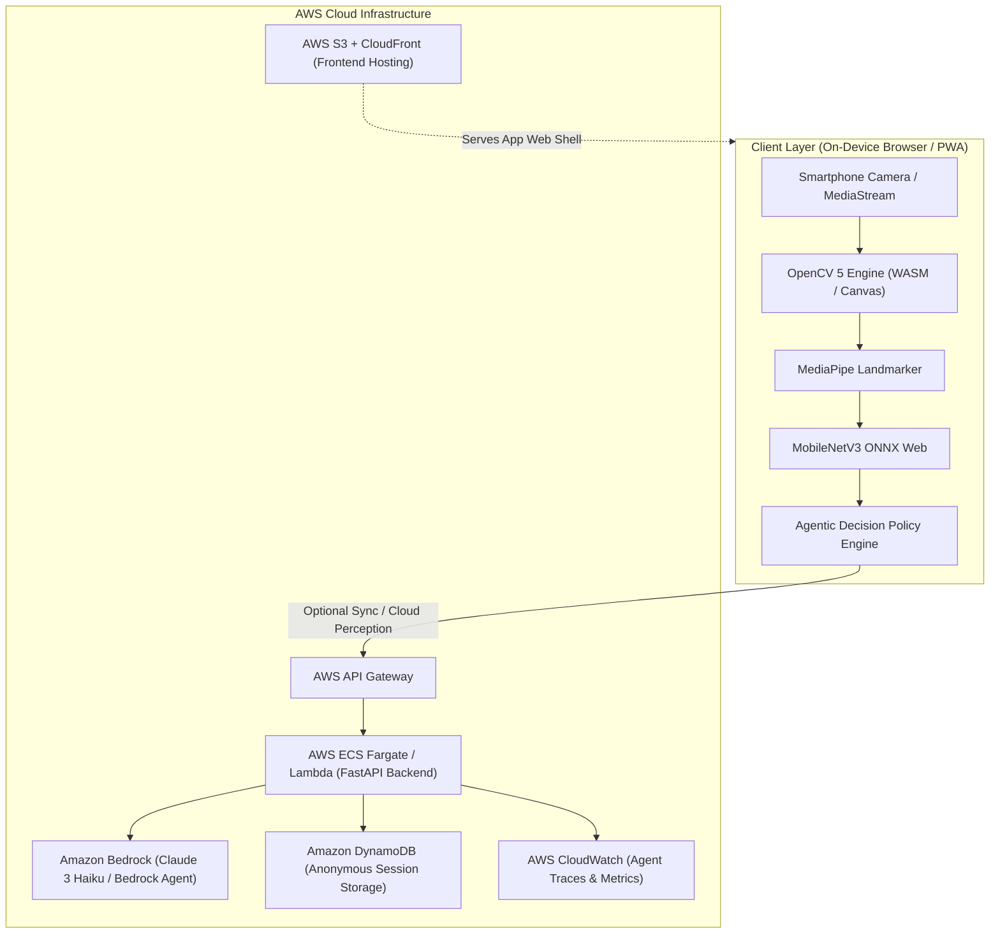

# RaktaScan — AWS Cloud Architecture & Deployment Guide

**OpenCV AI Competition 2026, powered by AWS**  

---

## 1. System Architecture Diagram (Mermaid)

---

## 2. Component Mapping

| AWS Service | Role in RaktaScan Architecture | Implementation File |
|---|---|---|
| **Amazon Bedrock** | Clinical AI Agent orchestration, tool execution policy & natural language explanation | `backend/app/aws_bedrock.py` |
| **AWS API Gateway** | Secure API endpoint management for frontend-backend communication | `backend/app/main.py` |
| **AWS ECS / Lambda** | Containerized execution of OpenCV 5 FastAPI backend service | `backend/Dockerfile` |
| **Amazon DynamoDB** | Persistence of anonymous screening session records, metrics & agent traces | `backend/app/aws_dynamodb.py` |
| **AWS CloudWatch** | Real-time logging of agent perception steps & computer vision performance | `backend/app/aws_cloudwatch.py` |
| **AWS S3 + CloudFront**| High-availability static edge delivery for PWA application | `frontend/dist/` |

---

## 3. Privacy & On-Device Boundary

- **On-Device Processing (Default)**: Raw camera video frames, face landmarks, and cropped conjunctiva images remain strictly inside the user's browser/device memory.
- **AWS Cloud Sync (Consent Required)**: Only anonymized visual metrics (e.g. $\text{EPI} = 0.52$, $\text{Sharpness} = 135$) and agent trace logs are synced to Amazon DynamoDB and CloudWatch.
- **No Unconsented Image Storage**: Raw facial images are never transmitted or stored in the cloud without explicit user opt-in.
